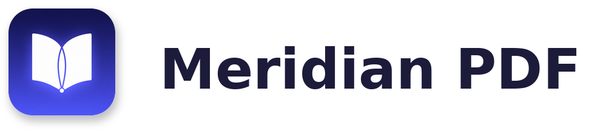
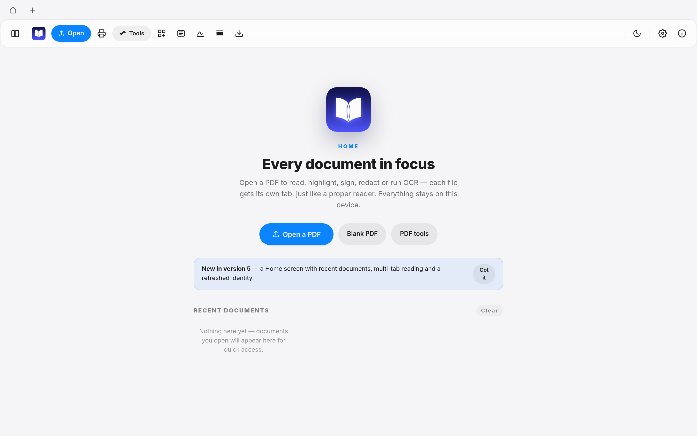
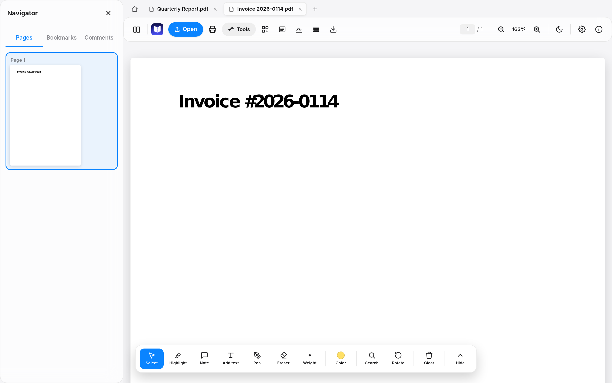
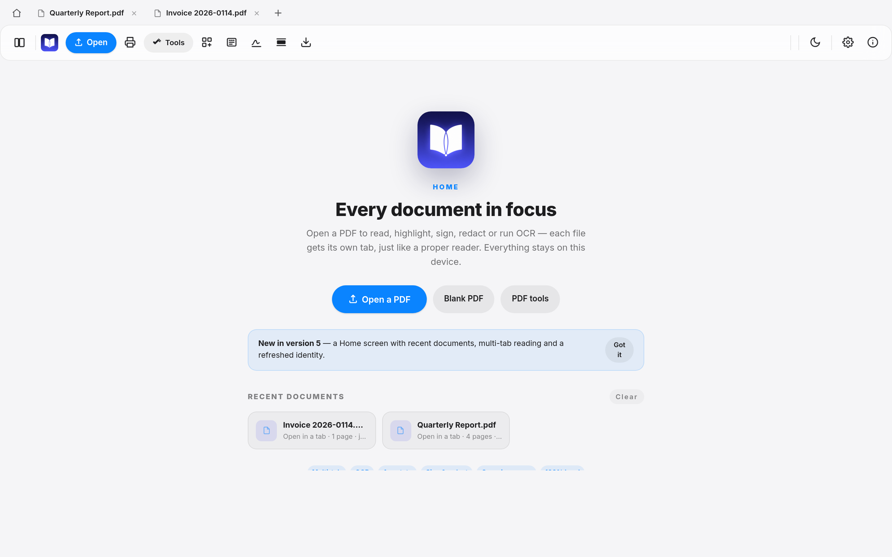
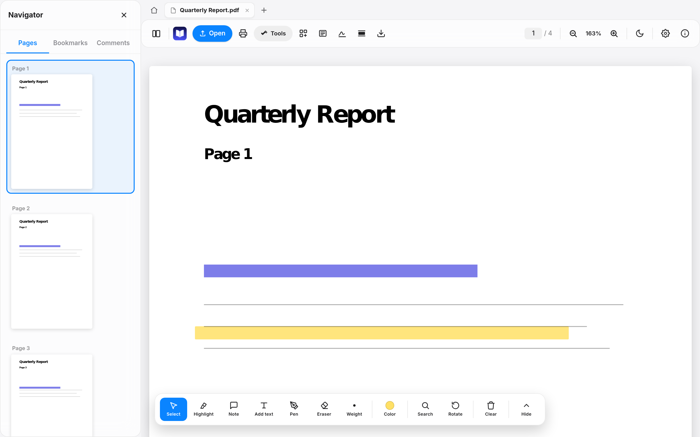
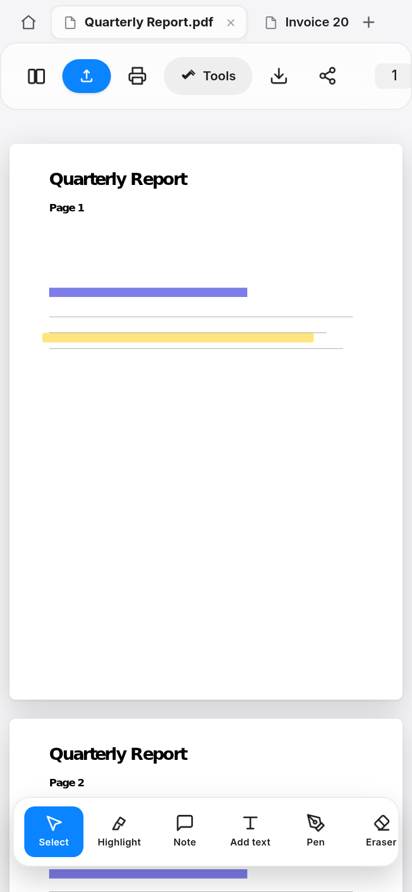

  <picture>
    <source media="(prefers-color-scheme: dark)" srcset="assets/strip-dark.png">
    
  </picture>

<h1 align="center">Meridian PDF</h1>

  <b>A fast, private, multi-tab workspace for reading, annotating and organising PDFs — in a single HTML file.</b> 
  No install. No account. No uploads. Your documents never leave your device.

     

---

## What is it?

Meridian PDF is a complete PDF reader and markup tool that lives in **one self-contained `index.html`**. Open it in any modern browser — desktop or phone — and you have a full document workspace: multi-tab reading, a Home screen with recent documents, highlights, notes, freehand pen, text overlays, OCR, form filling, digital signing, redaction, page organisation, and export to PDF/Word/PowerPoint/Excel/images.

The entire engine runs client-side (pdf.js + pdf-lib), so it works from a local file, a USB stick, or GitHub Pages — even on a plane.

## Version 5 highlights

| | |
|---|---|
| 🏠 **Home & Welcome page** | Land on a real Home screen — open a file, start a blank PDF, or jump back into a recent document. |
| 🗂 **Multi-tab documents** | Open as many PDFs as you like, each in its own tab, just like Acrobat. Switching tabs preserves each document's page, zoom, annotations, bookmarks and OCR state. Middle-click or ✕ to close. |
| 🎨 **New identity** | A crisp new meridian logo marks the app everywhere — the name appears only in **About**, where it belongs. |
| ⚡ **Same engine, version 5** | Everything from earlier releases is still on board. |

## Screenshots

**Home — every document in focus**

**Multi-tab reading, Acrobat-style**

**Recent documents, one click away**

**Full annotation toolset**

**Works great on phones**

## Everything on board

- **Read** — continuous scroll, thumbnails, bookmarks, outline, per-document reading position, fit-to-width, pinch zoom
- **Annotate** — text highlights, sticky notes with comments, freehand pen, eraser, editable text overlays, custom colors
- **OCR** — on-device text recognition for scanned pages, with a selectable text layer and searchable OCR PDF export
- **Organise** — rotate / reorder / delete / insert / extract pages; merge and split
- **Secure** — permanent redaction, document signing with cryptographic certificates, password-protected file support
- **Export** — annotated PDF (readable in Acrobat/Preview), flattened PDF, Word, PowerPoint, Excel, plain text, PNG archive
- **Print** — full print preview with paper-size-aware layout
- **Comfort** — light/dark themes, accent colors, dockable toolbars, focus mode, keyboard shortcuts

## Run it

**Option 1 — one click:** download `index.html` and double-click it. That's the whole install.

**Option 2 — GitHub Pages:** visit the live deployment (see the About sidebar of this repo → *Website*).

> First launch fetches the pdf.js / pdf-lib engines from a CDN, so an internet connection is needed once. After that, the page can be used offline in most browsers via cache.

## Privacy

Meridian PDF has **no analytics, no telemetry, no network calls of its own**. Documents, annotations, bookmarks and OCR text are stored only in your browser's local storage, keyed per file. Nothing is ever uploaded.

## Tech

A single-file app built on [pdf.js](https://github.com/mozilla/pdf.js) (rendering) and [pdf-lib](https://github.com/Hopding/pdf-lib) (writing), with Tailwind for styling. The v5 tab engine snapshots per-document state on switch, so memory stays flat no matter how many tabs are open.

## License

[MIT](LICENSE) © 2026 Comet-Suite
